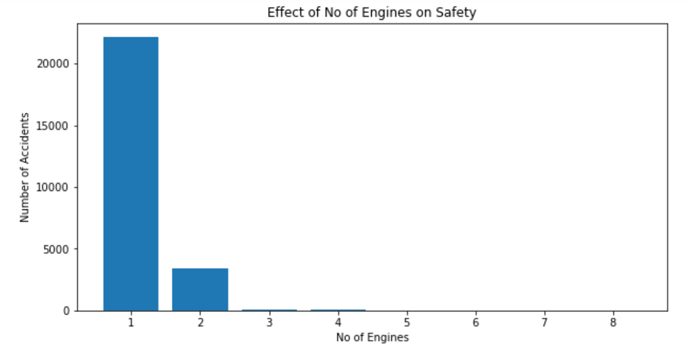
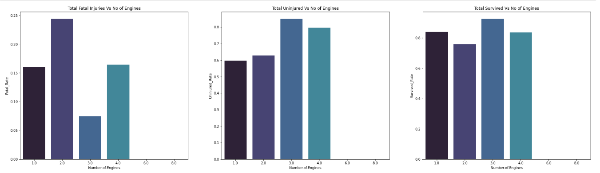
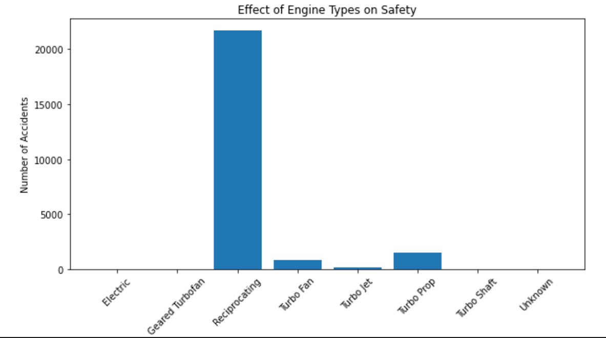
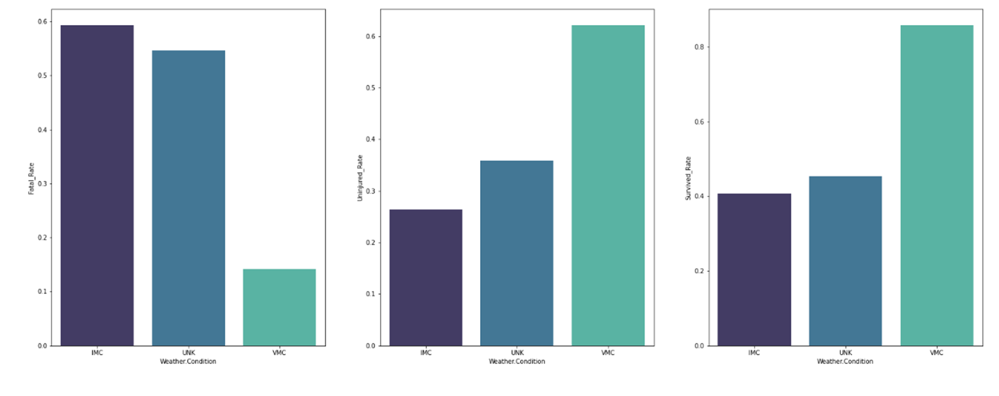
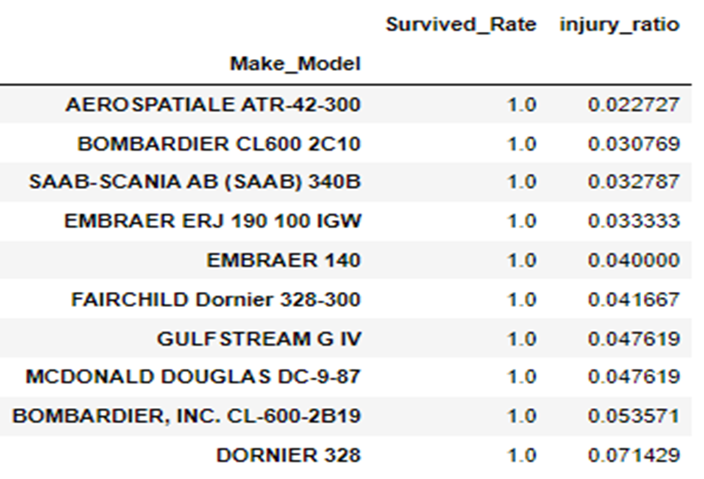
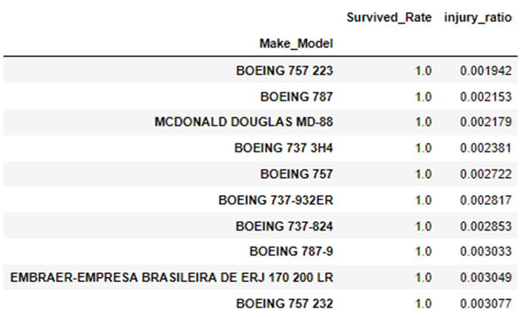

# Aircraft Safety Analysis - Data Insights for New Aviation Ventures
# Project Summary
Welcome to the Aircraft Safety Analysis project! Here, we embark on a comprehensive journey through data cleaning, in-depth analysis, and insightful visualization to uncover trends in airplane accidents spanning from 1963 to 2023. Our ultimate goal is to equip the new aviation division with the vital insights needed to make informed decisions about the safest aircraft options for both commercial and private operations.

# Business Problem
Our company is thinking of venturing into the aviation industry, with plans to acquire and operate airplanes for commercial and private purposes. However, in this new territory, we lack crucial knowledge about the potential risks associated with different aircraft models. It's our role as data scientists to identify the aircraft models that pose the lowest safety risks. By doing so, we provide the head of the new aviation division with actionable insights that will guide their aircraft purchasing decisions.

# Dataset Description
The dataset at hand comprises 90,000+ rows, each representing an aviation accident. It features 31 columns including:

Event.Id
Investigation.Type
Accident.Number
Event.Date
Location
Country
Latitude
Longitude
Airport.Code
Airport.Name
Injury.Severity
Aircraft.damage
Aircraft.Category
Registration.Number
Make
Model
Amateur.Built
Number.of.Engines
Engine.Type
FAR.Description
Schedule
Purpose.of.flight
Air.carrier
Total.Fatal.Injuries
Total.Serious.Injuries
Total.Minor.Injuries
Total.Uninjured
Weather.Condition
Broad.phase.of.flight
Report.Status
Publication.Date
The dataset's columns encompass a mix of strings and floats, capturing diverse aspects of aviation accidents, including aircraft details, injuries, and environmental conditions.

# Data Science Approach
Data Cleaning:
 We initiated our journey by meticulously cleaning the dataset. Addressing missing values, rectifying inconsistencies, and handling errors were our primary objectives. This step sets the foundation for reliable analysis.
 Upon refining the data, we identified 28,626 values that will significantly contribute to our decision-making process.
 
Exploratory Data Analysis (EDA): Our next endeavor involved an extensive EDA to uncover hidden patterns, trends, and correlations within the dataset. Key variables that influence accident rates and severity were identified.

# Risk Assessment: 
Leveraging the data provided, we quantified the safety risks associated with different aircraft models. This assessment formed the cornerstone of our recommendations.

# notebooks: 
[Notebook](student.ipynb)
Jupyter notebooks detailing data cleaning and risk assessment.

## Visualization: 
We transformed our insights into compelling visualizations that effectively communicate accident trends, safety ratings, and risk assessments.

# Tableau
[Tableau](https://public.tableau.com/app/profile/yasitha.de.alwis/viz/AirplaneSafety_16929863959810/Dashboard1?publish=yes)
# Decision Support
Our findings provide actionable insights to guide the decision-making process for the new aviation division. By identifying low-risk aircraft models, working to ensure safety and success in this new business endeavor.
# Conclusion
As per the analysis it is recommended to purchase flights with 2 engines, VMC weather controls, and avoid reciprocating engines.

Considering the finance and other factors it is recommended to purchase Boeing 737 as a commercial flight and Gulfstream G IV as a private flight to the fleet.
